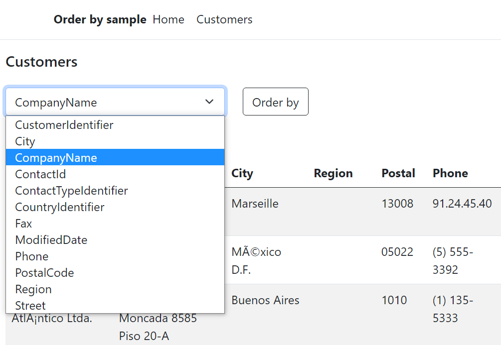

# About

In this code sample a DropDown is loaded with property names from a model which in turn provide the ability to perform an order by, ascending on the selected property in the DropDown.

The order by is explained in the following article [EF Core order by string column name](https://dev.to/karenpayneoregon/ef-core-order-by-string-column-name-4549)


## Creating the Dropdown

1. Using a custom method for EF Core, read properties for the Customer Model into the model `SqlColumn`
1. Create a `SelectList` passing in data from above, set the data and text fields.

## OnPost

The value for `id` comes from setting the data field for the `SelectList` in `OnGetAsync` when creating the select list.

```csharp
public async Task OnPostSubmit(int id)
```

## JavaScript

When a selection is made and submitted the id is stored in local storage then on document load if there is a value this becomes the selected index for the DropDown.


