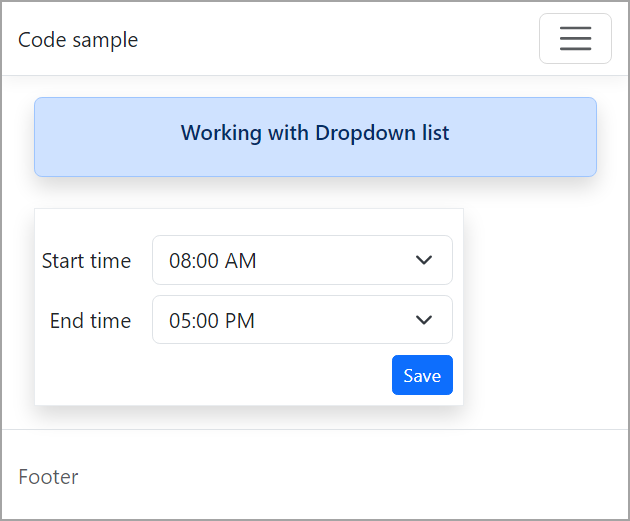
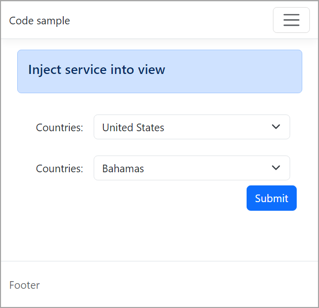
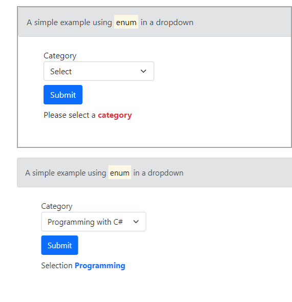

# About

Contains three projects for showing how to use a select/DropDown with Razor Pages.

## Requires

- Microsoft Visual Studio 2022 or later
- .NET Core 7 (will work with .NET Core 6 with minor modifications).

## Article

DEV: [ASP.NET Core/Razor Pages using Dropdowns](https://dev.to/karenpayneoregon/-aspnet-corerazor-pages-using-dropdowns-3cl4)